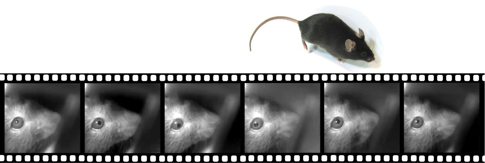

# mousecam

3D models and data extraction/analysis code for the head-mounted camera system described in:

AF Meyer, J Poort, J O'Keefe, M Sahani, and JF Linden: _A head-mounted camera system integrates detailed behavioral monitoring with multichannel electrophysiology in freely moving mice_, Neuron, Volume 100, p46-60, 2018. [link (open access)](https://doi.org/10.1016/j.neuron.2018.09.020)

This repository contains the following:

* **mousecam**: a [Python package](https://github.com/arnefmeyer/mousecam/tree/master/mousecam) with functions for extracting and analyzing data recorded using the camera system, including
    - pupil fitting (including GUI)
    - body tracking (including GUI)
    - image registration (via fiji/imagej)
    - extraction of head orientation
* **parts**: [3D models](https://github.com/arnefmeyer/mousecam/tree/master/parts) (openscad/stl) and building instructions for the head-mounted camera system

## News

- 04/11/18: This page is now also organized in a [website format](https://arnefmeyer.github.io/mousecam).
- 06/11/18: Added [parts list](docs/parts_list.md) as extra page

## Head-mounted camera code

Code (including open-ephys plugin) for controlling the camera and synchronizing video data with neural recordings is available [here](https://github.com/arnefmeyer/RPiCameraPlugin).

## Measurement of head orientation/movement data

Code (including open-ephys plugin) for controlling intertia measurement unit (IMU) sensors and synchronizing movement data with neural recordings is available [here](https://github.com/arnefmeyer/IMUReaderPlugin).

## Behavioral segmentation

A Python package for behavioral scoring (including GUI for manual annotation) can be found [here](https://github.com/arnefmeyer/BehavioralScoring).

## Contribute

If you are looking for a different variant of the design or want to contribute modified and/or new designs, you can find all files in the [3D model directory](https://github.com/arnefmeyer/mousecam/tree/master/parts). Please use the *issue tracker* to report problems with building the camera system and create *pull requests* for improved/new designs.

- Issue Tracker: https://github.com/arnefmeyer/mousecam/issues
- Source Code: https://github.com/arnefmeyer/mousecam
- Project Website: https://arnefmeyer.github.io/mousecam

## References

@Article{Meyeretal2018,
  author    = {Meyer, Arne F. and Poort, Jasper and O’Keefe, John and Sahani, Maneesh and Linden, Jennifer F.},
  title     = {A Head-Mounted Camera System Integrates Detailed Behavioral Monitoring with Multichannel Electrophysiology in Freely Moving Mice},
  journal   = {Neuron},
  year      = {2018},
  volume    = {100},
  number    = {1},
  month     = oct,
  pages     = {46--60},
  issn      = {0896-6273},
  doi       = {10.1016/j.neuron.2018.09.020},
  url       = {https://doi.org/10.1016/j.neuron.2018.09.020},
  publisher = {Elsevier},
}

