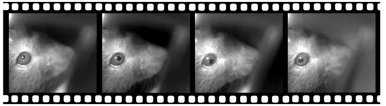

# mousecam

3D models and data extraction/analysis code for the head-mounted camera system described in:

AF Meyer, J Poort, J O'Keefe, M Sahani, and JF Linden: _A head-mounted camera system integrates detailed behavioral monitoring with multichannel electrophysiology in freely moving mice_, Neuron, Volume 100, p46-60, 2018. [link (open access)](https://doi.org/10.1016/j.neuron.2018.09.020)

This repository contains the following:

* **mousecam**: a Python package with functions for extracting and analyzing data recorded using the camera system, including
    - pupil fitting (including GUI)
    - body tracking (including GUI)
    - image registration (via fiji/imagej)
    - extraction of head orientation
* **parts**: 3D models (openscad/stl) and building instructions for the head-mounted camera system

## Head-mounted camera code

Code (including open-ephys plugin) for controlling the camera and synchronizing video data with neural recordings is available [here](https://github.com/arnefmeyer/RPiCameraPlugin).

## Measurement of head orientation/movement data

Code (including open-ephys plugin) for controlling intertia measurement unit (IMU) sensors and synchronizing movement data with neural recordings is available [here](https://github.com/arnefmeyer/IMUReaderPlugin).

## Behavioral segmentation

A Python package for behavioral scoring (including GUI for manual annotation) can be found [here](https://github.com/arnefmeyer/BehavioralScoring).

