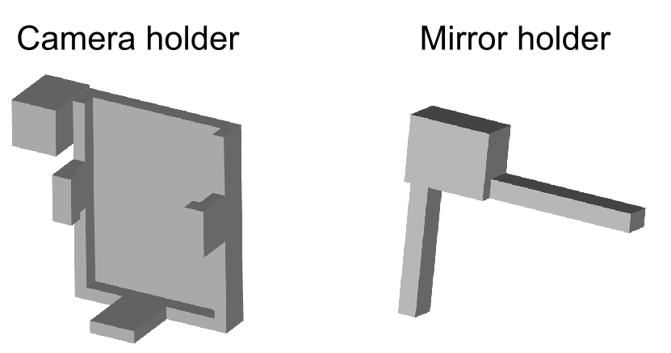
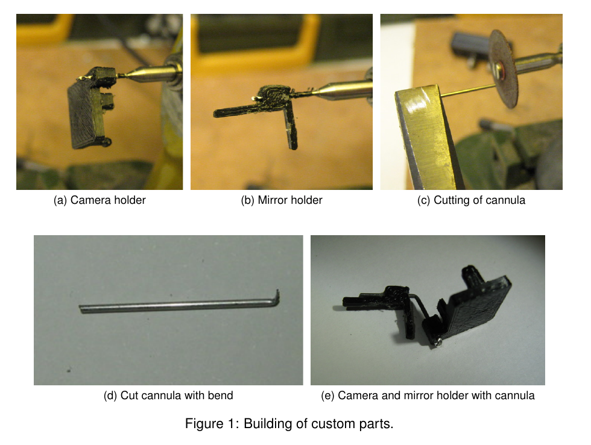

# Building instructions

## 1. Custom parts: camera and mirror holders

### Required tools and parts:

- 3D printer (e.g. Ultimaker 2)

- 3D printing material (e.g. Velleman PLA3B1)

- file, scalpel or other small knife

- camera holder STL file: [cam_holder.stl](./../parts/stl/cam_holder.stl)

- mirror holder STL file: [mirror_holder.stl](./../parts/stl/mirror_holder.stl)

Use the software for your 3D printer (e.g., Cura for Ultimaker) to
convert the STL files to a format your printer understands. After
printing clean up parts with file or scapel; try to fit camera into
holder (fit should be tight); and file side clips until camera fits in
holder.

Depending on the printer it might be useful to modify the designs such
that minimal filing/cutting is required after printing. The source files
(in [OpenSCAD](http://www.openscad.org/) format) are available in the
mousecam repository in the same directory as the STL files.

## 2. Assembling of the camera system

Note: construction of the camera system requires some off-the-shelf
parts. We provide example parts (supplier/item) as used in the above
paper but other parts might work as well.

### Required parts and tools:

-   Camera and mirror holders (see custom parts above)

-   21 G steel cannula (e.g., Coopers Needle Works). We successfully
    used thin-walled steel cannulas but other cannulas (e.g., a 21 G
    syringe needle after cutting the tip) will also work.

-   Infrared (IR) mirror (e.g., Qioptiq Calflex-X)

-   Small IR LED (e.g., Vishay VSMB2943GX01)

-   Small resistor, 150--200  (e.g., Farnell Multicomp, package 3216)

-   2 x 30--36 AWG wire (e.g., Alpha Wire 2936); length $\approx$ 5 cm

-   Miniature connectors for connecting the camera system to the
    implant/skull (e.g., Omnetics A79007-001/A79010-001 or 8-pin
    Mill-Max connectors)

-   optional: 2 x female gold pin (e.g., RS Components 481-500)

-   Dremel (e.g. Proxxon D-54518) with cutting disc (e.g. wheel no. 409)
    and 0.8 mm drill bit (DU68.10)

-   glass cutter; most glass cutters should work. We successfully used
    [this one](https://www.screwfix.com/p/vitrex-6-wheel-glass-cutter/10706).

-   2 combination pliers; if available 1 self-locking hemostat pliers

-   A length measuring device (e.g., ruler or caliper)

-   A thin and straight solid object, e.g., a metal ruler, for guiding
    glass cutter

### Steps:

1.  Drill hole in the camera holder with Dremel and 0.8 mm drill bit
    (Figure 1a). Use hemostat or other pliers (not
    shown in photo) to hold the camera holder while drilling.

2.  Drill hole in the mirror holder (holding it with pliers) using
    Dremel and 0.8 mm drill bit     (Figure 1b).

3.  Cut cannula (21 G) to approx. 2 cm with cutting disc on Dremel
    (Figure 1c). Use safety glasses and hold both
    ends with pliers. Bend with second pliers at one of the ends to give
    sharp bent tip (Figure 1d). The bent tip will be fixed with
    a drop of epoxy to the back of the camera holder later on to prevent
    the mirror holder from rotating around the axis of the cannula.

4.  Push cannula from the back of the camera holder through the hole
    until the back of the camera holder hits the bent tip of the
    cannula.

5.  Bend cannula in the middle (approx. 1 cm) by about
    approx. 60&deg; using pliers. See Figure 1e) for a camera holder 
	with mirror holder and bent cannula.

6.  To cut the infrared (IR) mirror (e.g. Qioptiq Calflex-X 25 x 25 mm),
    first mark desired size (e.g., 7 x 7 mm for a relatively large
    field-of-view including eye and whiskers) with a removable marker.
    Score with glass cutter (along a thin solid object, e.g., a metal
    ruler) along one side of mirror. Break off scored line by holding
    both sides with pliers and carefully moving one pair up or down
    (wearing safety glasses). The mirror packing paper, a lens cleaning
    tissue, or some thin rubber sheet can be used to protect the mirror.
    Note: breaking glass is tricky and may occasionally result in a
    jagged edge; repeat until edge is satisfactory. Glue sharp side
    against mirror holder and cover outside with super glue or epoxy if
    necessary. It is also possible to use a file to get rid of sharp
    edges.

7.  Glue cut mirror tile to 3D printed mirror holder. A very thin layer
    of super glue (e.g., Loctite Power Flex Gel) is sufficient to
    permanently fix the mirror to the mirror holder.

8.  Put a very thin layer of super glue onto the cannula and gently push
    the cannula into the hole in the mirror holder. This will secure the
    mirror, but will still allow for positioning the mirror later on
    during calibration (see [Calibration](calibration.md)).

9.  Attach LED with a tiny drop of super glue to the bottom of the
    camera holder.

10. Solder a current-limiting resistor to the anode (+) of the LED
    (unless it is simpler to solder the LED closer to the power source).
    The value of the resistor depends on the LED and the power source
    (there are plenty of on-line tools, e.g., [this
    one](http://ledcalc.com/), to calculate the resistor value). Secure
    LED and resistor using a thin layer of (transparent) epoxy.

11. Solder two thin wires (30--36 AWG) to the cathode (-) of the LED and
    the resistor. The length of the wire depends on the distance between
    the camera holder and the LED power source. For the Intan headstage
    used in the paper about 5 cm wires were long enough. Moreover, in
    order to quickly connect/disconnect the wires to/from the power
    source during experiments it might be useful to use miniature gold
    pins and sockets. Cut away the solder pots, solder the wires to the
    pin sockets and secure the wires with a tiny drop of epoxy. Finally,
    solder the corresponding pins to the power source (e.g., the solder
    holes of the Intan headstage).

12. Fix connector (e.g., Omnetics A79007-001 after cutting away solder
    tails) using super glue to the back of the camera holder. See
    [Figure S1](https://www.cell.com/cms/10.1016/j.neuron.2018.09.020/attachment/0d7fad46-0021-44ca-ac57-d2f0a3dff074/mmc1.pdf) 
	in the [paper](https://www.cell.com/neuron/fulltext/S0896-6273(18)30822-5) 
	for an example of a fully assembled camera system with connector.

